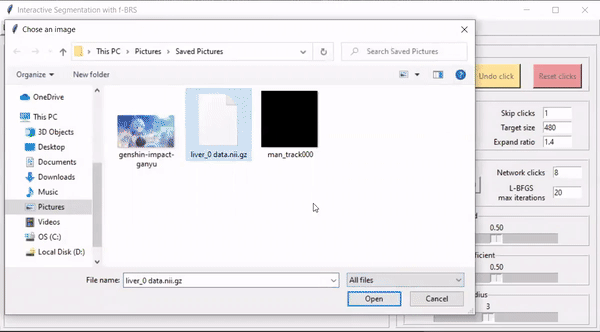

# 3d medical interactive segmentation
## Overview
This supervised learning project is about doing segmentation on 3d medical images with an extra input from users' clicks on the objects they want to segment. The coding of this project is done by modifying codes from Samsung AI Center's 2020 f-brs click-based interactive segementation project. In that project, the click-based interactive segmentation is done on RGB 2d pictures, and the main accomplishment of this project is extending the application to 3d volumetric medical CT images. The architecture of the deep neural network for this project is deeplab v3+ with 3D Resnet-34 backbones. To demonstrate the interactive segmentation process, I also modify the demo app from the original 2d project and make it able to show and segment 3d images page by page. Demo application allow users to give extra inputs from their clicks' coordinates, and this process is modeled by the trainer by sampling random points on the objects during training. The resulting model after training achieves a dice score of 0.9 on the spleen dataset in medical decathlon. 
## Training
Training of this project is done on Google Colab. The datasets that we choose for this project are spleen, liver, and lung datasets from <a href=http://medicaldecathlon.com/ title="Flaticon">medical decathlon</a>. To train datasets with this project, please first download datasets from medical decathlon official website, create a new empty directory "datasets", and put downdloaded datasets into this directory. Then include the path in config.yml and run command like the following:
```
python3 train.py --model_path=models/spleen/r34_dh128.py --gpus=0 --workers=0 --exp-name=first-try --mode=train --sliding-window=True
```
Sliding window option here is for whether doing validation using sliding window technique. If the option is true, the trainer will split the input images for validation into a number of 160*160*160 images to separately go through the network and do validation. 
## Evaluation and Demo
To evaluate the performance of post-trained models, users need to locate their checkpoint in the experiment directory and run command like following:
```
python3 train.py --model_path=models/spleen/r34_dh128.py --gpus=0 --workers=0 --exp-name=your_exp_name --resume-exp=your_exp_number --resume-prefix=your_checkpoint_number --mode=evaluate --sliding-window=True
```
To run the demo application, users can need to load in their checkpoint and run command like following in their local machines:
```
python3 demo.py --checkpoint=your_checkpoint_name --gpu=0
```
The segmentation process in the demo app will be like:

## License Notice and References
* This project is based on the <a href="https://github.com/saic-vul/fbrs_interactive_segmentation" title="Flaticon">f-brs click-based interactive segementation project</a>, and therefore should be as a reference to that project. Since the original project has MPL 2.0 License, all files in this project are also licensed under this license.
* APA format of their paper reference: Sofiiuk, K., Petrov, I., Barinova, O., Konushin A. (2020)  Rethinking Backpropagating Refinement for Interactive Segmentation, arXiv preprint arXiv:2001.10331
* Method named "new_slidng_window_inference" in isegm/engine/trainer.py is a method written by modifying the sliding_window_inference method from <a href="https://github.com/Project-MONAI/MONAI" title="MONAI">MONAI library</a>. Since MONAI has Apache-2.0 license, this method in my directory is also licensed under Apache-2.0 license and references MONAI. 
